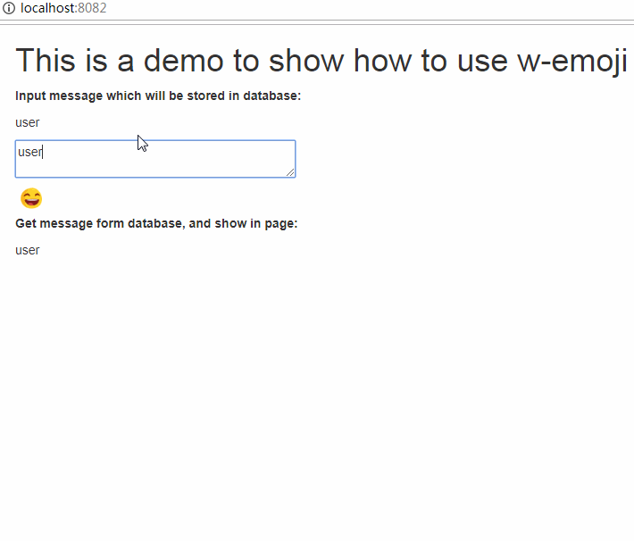

# w-emoji

最近一个项目需要用到emoji表情包，从网上搜集到的信息来看，绝大部分的emoji项目都侧重怎么在界面上展示emoji表情。

**但是一个emoji表情怎样存储到数据库，然后再从数据库中取出来在界面上展示了？**

这个项目基于[emoji-mart-vue](https://github.com/jm-david/emoji-mart-vue)，重点解决了表情的存储和展示。

**解决思路**: 每一个表情都有一个唯一的id，用户输入信息存储到数据库时，将表情的id替换成\\[:id:\\]格式的字符串存储到数据库中；从数据库取出字符串后，解析该字符串，将[\:id\:]替换为表情符号在界面上展示。

## demo演示



## Build Setup

``` bash
# install dependencies
npm install

# see demo with hot reload at localhost:8082
npm run dev

# build w-emoji with minification
npm run build
```
